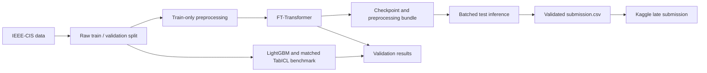

# Transaction Fraud Transformer

A Transformer-first fraud detection project using IEEE-CIS transaction data,
Kaggle GPUs, and matched tabular-model benchmarks. The main model is an
FT-Transformer trained from scratch, not an LLM. TabICL is a pretrained comparison.

[Kaggle notebook](https://www.kaggle.com/code/rajaamlan/notebook70df114be2)
| [Reproducible notebook](notebooks/building-transformers-v2.ipynb)
| [Verified experiment report](docs/kaggle_verified_run.md)
| [Submission guide](docs/submission.md)

## Results

### Kaggle late submission

**Accepted and scored:** FT-Transformer predictions for all 506,691 test transactions.

| Public ROC-AUC | Private ROC-AUC |
| ---: | ---: |
| **0.867624** | **0.844891** |

[Submitted notebook version 2](https://www.kaggle.com/code/rajaamlan/notebook70df114be2?scriptVersionId=351207506)
was evaluated after the deadline; this is not a prize-eligible entry.
The [machine-readable scorecard](results/scorecard.json) records scores and CSV hash.

### Main experiment

50,000 sampled transactions: 40,000 training / 10,000 validation, 432 features,
seed 42. Preprocessing is fitted on training rows only.

| Model | ROC-AUC | Average precision (AUPRC) |
| --- | ---: | ---: |
| LightGBM baseline | 0.891275 | 0.608177 |
| **FT-Transformer (primary model)** | **0.853336** | **0.417455** |

The Transformer uses 64-dimensional tokens, four attention heads, two layers,
five epochs, class-weighted loss, and batches of 64. Both training and validation
are batched to fit a Tesla T4. Saved-checkpoint inference was verified against
the original validation predictions.

### Small matched foundation-model benchmark

2,000 training / 1,000 validation rows, the same 100 training-selected features.
This is a separate experiment, **not directly comparable to the table above**.

| Model | ROC-AUC | Average precision (AUPRC) | Status |
| --- | ---: | ---: | --- |
| LightGBM matched | 0.575251 | 0.144277 | Completed |
| TabICL | **0.823262** | **0.254056** | Completed |
| TabPFN | - | - | Installed; model access requires license acceptance |
| TabFM | - | - | Not implemented |

TabICL wins this small comparison. Approximately 36 positive validation examples,
a single split, and a single-member pretrained ensemble limit the conclusion.

## Pipeline



## Reproduce On Kaggle

1. Import `notebooks/building-transformers-v2.ipynb` into Kaggle.
2. Attach IEEE-CIS Fraud Detection; select a T4 GPU.
3. Enable Internet for pretrained-model package and checkpoint downloads.
4. Run training and artifact verification. Foundation comparisons are optional.
5. Run the final submission section to create `submission.csv`,
   `submission_manifest.json`, and `results.json`.
6. Save a version **with outputs**, then submit `submission.csv` to IEEE-CIS.

The final section can reuse the original notebook's saved version 1 output without
retraining. See the [submission guide](docs/submission.md).
The submission uses the development checkpoint trained on 40,000 rows, not a
full-dataset retrain. Validation metrics are not Kaggle leaderboard scores.

## Repository Layout

| Path | Purpose |
| --- | --- |
| `notebooks/building-transformers-v2.ipynb` | Training, benchmarks, verification, submission |
| `scripts/kaggle_submission.py` | Chunked inference and strict CSV validation |
| `scripts/kaggle_finalize_cell.py` | Restore checkpoint, generate CSV, collate results |
| `scripts/build_submission_notebook.py` | Synchronize final notebook cells with scripts |
| `tests/test_kaggle_submission.py` | Alignment and preprocessing edge cases |
| `src/fraud_model/` | Separate training CLI and FastAPI scoring scaffold |

## Local Development

```powershell
python -m venv .venv
.\.venv\Scripts\Activate.ps1
pip install -r requirements.txt
$env:PYTHONPATH = "src"
pytest -q
```

Submission validation tests do not need a GPU:

```powershell
python -m unittest discover -s tests -p test_kaggle_submission.py -v
```

## API Scaffold

The API and Docker scaffold are included, but the Kaggle checkpoint and
`preprocessing.pkl` are **not drop-in compatible** with the CLI's
`model.pt` / `preprocessor.json` contract. Deployment integration remains work to do.
To exercise the separate CLI/API path with sample data:

```powershell
$env:PYTHONPATH = "src"
python -m fraud_model.train --data data/sample_transactions.csv --label-column is_fraud --artifact-dir artifacts
uvicorn fraud_model.api:app --host 0.0.0.0 --port 8000
```

## Limitations And Next Steps

- Add chronological validation and an untouched test period before deployment claims.
- Class-weighted outputs need separate probability calibration and threshold validation.
- Complete TabPFN after authorized model access; TabFM has no result.
- Evaluate larger matched samples and several seeds before declaring a general winner.
- Integrate the notebook artifact contract with the API before deploying this checkpoint.

## Data And License

Code: [Apache 2.0](LICENSE). IEEE-CIS data and pretrained weights retain their own
terms. Raw competition data, credentials, and binary checkpoints are not committed.

Dataset: [IEEE-CIS Fraud Detection, Kaggle (2019)](https://www.kaggle.com/competitions/ieee-fraud-detection).
