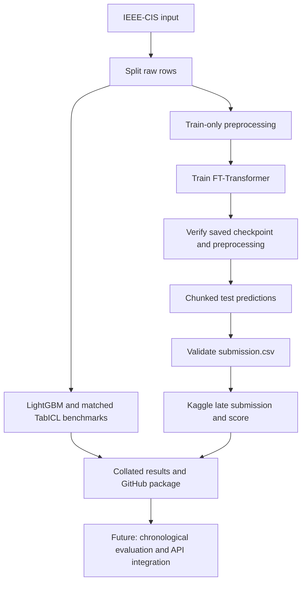

# Pipeline

The Transformer is the submission model. LightGBM and TabICL benchmarks completed.
TabPFN is blocked on model access; TabFM is not implemented.

## Current Scorecard

See the [verified report](kaggle_verified_run.md) and [README](../README.md).
The main Transformer achieved ROC-AUC 0.853336 and average precision 0.417455.

## Resource Constraints

The earlier 150k-row configuration caused a T4 memory failure. The verified
experiment uses 50k sampled rows, dimension 64, two layers, and batch size 64.
Do not increase data or model size without measuring memory usage.
